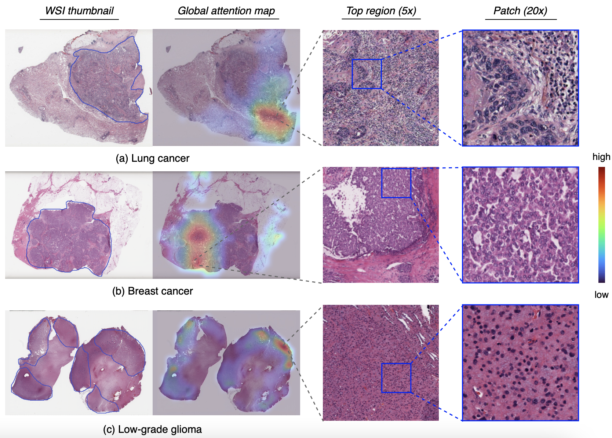

# DSCA: A Dual-Stream Network with Cross-Attention on Whole-Slide Image Pyramids for Cancer Prognosis

**Preprint**: [arXiv:2206.05782](https://arxiv.org/abs/2206.05782)

**Authors**: Pei Liu, Bo Fu, Feng Ye, Rui Yang, and Luping Ji

**Abstract**: The cancer prognosis on gigapixel Whole-Slide Images (WSIs) has always been a challenging task. To further enhance WSI visual representations, existing methods have explored image pyramids, instead of single-resolution images, in WSIs. In spite of this, they still face two major problems: high computational cost and the unnoticed semantical gap in multi-resolution feature fusion. To tackle these problems, this paper proposes to efficiently exploit WSI pyramids from a new perspective, the dual-stream network with cross-attention (DSCA). Our key idea is to utilize two sub-streams to process the WSI patches with two resolutions, where a square pooling is devised in a high-resolution stream to significantly reduce computational costs, and a cross-attention based method is proposed to properly handle the fusion of dual-stream features. We validate our DSCA on three publicly-available datasets with a total number of 3,101 WSIs from 1,911 patients. Our experiments and ablation studies verify that (i) the proposed DSCA could outperform existing state-of-the-art methods in cancer prognosis, by an average C-Index improvement of around 4.6%; (ii) our DSCA network is more efficient in computation---it has more learnable parameters (6.31M vs. 860.18K) but less computational costs (2.51G vs. 4.94G), compared to a typical existing multi-resolution network. (iii) the key components of DSCA, dual-stream and cross-attention, indeed contribute to our model's performance, gaining an average C-Index rise of around 2.0% while maintaining a relatively-small computational load. Our DSCA could serve as an alternative and effective tool for WSI-based cancer prognosis.

## DSCA Overview


It's the overview of our DSCA scheme. We illustrate our scheme using lambda=4 and a=256. (a) Spatially-aligned dual-resolution patching: S x and 4S x image are sliced into non-overlapping patches and their features are extracted by a pre-trained model. (b) DSCA architecture. (c) Transformer encoder in DSCA. (d) Cross-attention pooling: it's an implementation of square pooling that pools high-resolution tokens under the guidance of low-resolution ones.

## Experiments
Overall performance in WSI-based prognosis (prediction performance measured by 5-fold cross-validation):


Ablation study of dual-stream and cross-attention:


## Visualization
Cross-attention maps:


Global attention maps:


## More

Any issues can be sent via E-mail (yuukilp@163.com) or the Issue Page of this repo.

If you found this work helps you more or less, please cite 
```
@article{liu2022dsca,
  title={DSCA: A Dual-Stream Network with Cross-Attention on Whole-Slide Image Pyramids for Cancer Prognosis},
  author={Liu, Pei and Fu, Bo and Ye, Feng and Yang, Rui and Xu, Bin and Ji, Luping},
  journal={arXiv preprint arXiv:2206.05782},
  year={2022}
}
```
