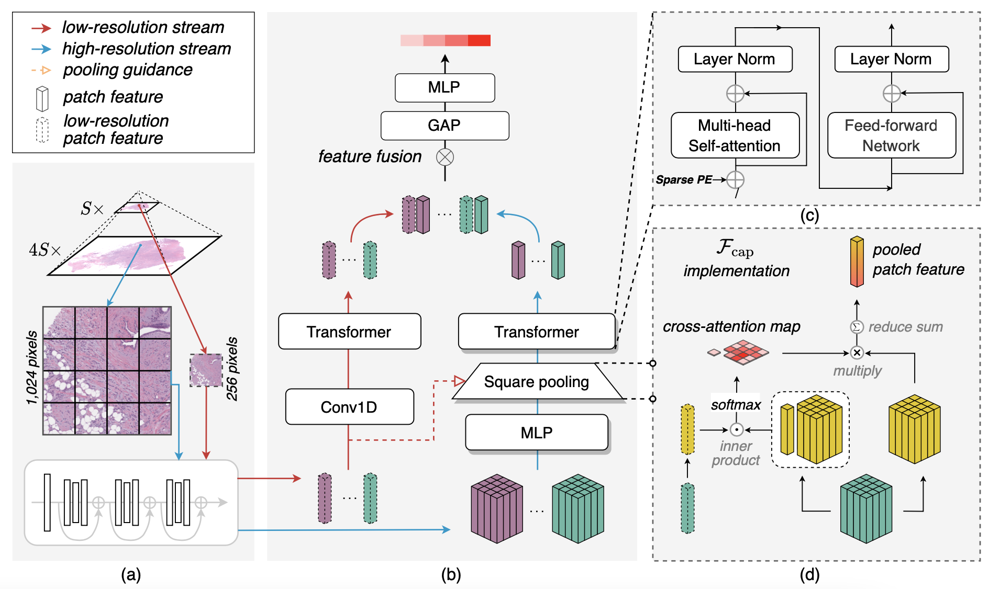
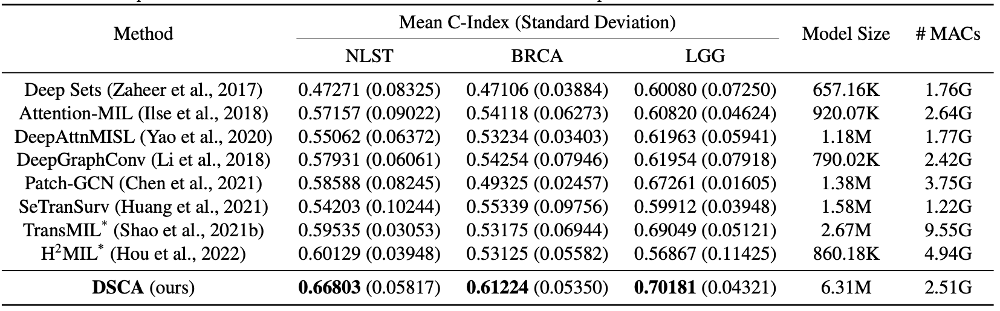
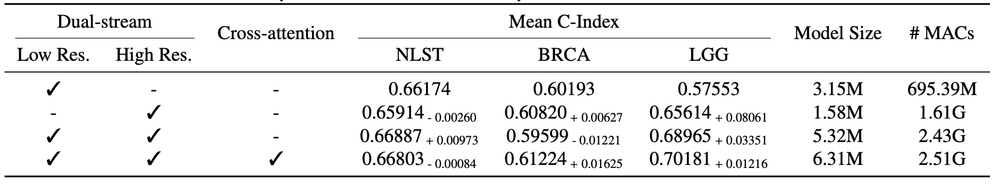

# DSCA: A Dual-Stream Network with Cross-Attention on Whole-Slide Image Pyramids for Cancer Prognosis

**Journal link**: [j.eswa.2023.120280](https://doi.org/10.1016/j.eswa.2023.120280), *Expert Systems With Applications*.

**Preprint**: [arXiv:2206.05782](https://arxiv.org/abs/2206.05782)

**Dateset link**: [NLST](https://cdas.cancer.gov/datasets/nlst/), [TCGA-BRCA](https://portal.gdc.cancer.gov/projects/TCGA-BRCA), and [TCGA-LGG](https://portal.gdc.cancer.gov/projects/TCGA-LGG). Please see the details of data preparation at [DSCA walkthrough - Data preparation](#data-preparation).

## Brief introduction



*TL;DR*: 
> Existing methods of survival analysis on multi-scale WSIs still face two major problems: high computational cost and the unnoticed semantical gap in multi-resolution feature fusion. Inspired by modern CNNs, this work proposes to efficiently exploit WSI pyramids from a new perspective, the dual-stream network with cross-attention (DSCA). Our key idea is to utilize two sub-streams to process the WSI patches with two resolutions, where a square pooling is devised in a high-resolution stream to significantly reduce computational costs, and a cross-attention based method is proposed to properly handle the fusion of dual-stream features. Our scheme could be easily extended to multi-branch for multi-resolution WSIs. The experiments on three publicly-available datasets confirm the effectiveness of DSCA in predictive performance and computational cost.

## DSCA walkthrough 

Here we show **how to run DSCA** for cancer prognosis using WSI pyramids. The dataset `TCGA-BRCA` will be taken as example.

### Data preparation

First of all, you should download the slides from the project `TCGA-BRCA` in official TCGA website. The details regarding slide donwload can be found at [the first tutorial - Downloading-Slides-from-TCGA](https://github.com/liupei101/Pipeline-Processing-TCGA-Slides-for-MIL/blob/main/S01-Downloading-Slides-from-TCGA.ipynb) and [the second tutorial - Reorganizing-Slides-at-Patient-Level](https://github.com/liupei101/Pipeline-Processing-TCGA-Slides-for-MIL/blob/main/S02-Reorganizing-Slides-at-Patient-Level.ipynb). **Note** that the dataset label of patient survival is available at `./data_split/tcga_brca/tcga_brca_path_full.csv` so you can skip some steps of label data acquisition in the second tutorial. 

Then, just like most procedures of WSI analysis, we process each WSI into small patches. A detailed tutorial is given in [the third tutorial - Segmenting-and-Patching-Slides](https://github.com/liupei101/Pipeline-Processing-TCGA-Slides-for-MIL/blob/main/S03-Segmenting-and-Patching-Slides.ipynb). Specifically, to obtain the region-aligned patches at a high resolution and a low one, we first process each WSI into patches at a low resolution (`level = 2`, downsampled `16x`) using the command as follows
```bash
# Sample patches of SIZE x SIZE at LEVEL 
LEVEL=2
SIZE=256

# NOTE: the following paths, for illustruting, should be replaced by your owns
# Path where CLAM is installed (refer to the third tutorial)
DIR_REPO=./CLAM
# Root path to pathology images 
DIR_READ=/NAS02/RawData/tcga_brca
# Root path to result files 
DIR_SAVE=/NAS02/ExpData/tcga_brca

cd ${DIR_REPO}

echo "run seg & patching for all slides"
CUDA_VISIBLE_DEVICES=0 python3 create_patches_fp.py \
    --source ${DIR_READ} \
    --save_dir ${DIR_SAVE}/tiles-l${LEVEL}-s${SIZE} \
    --patch_size ${SIZE} \
    --step_size ${SIZE} \
    --preset tcga.csv \
    --patch_level ${LEVEL} \
    --seg --patch --stitch \
    --no_auto_skip --in_child_dir
```

And then we run the script `./tools/big_to_small_patching.py` to obtain aligned high-resolution patches (`level = 1`, downsampled `4x`) by directly transforming the coordinates of low-resolution patches, using the following command
```bash
python3 big_to_small_patching.py \
    /NAS02/ExpData/tcga_brca/tiles-l2-s256 \
    /NAS02/ExpData/tcga_brca/tiles-l1-s256
```

Finally, we extract features from the high- and low-resolution image patches. A detailed tutorial is given in [the fourth tutorial - Extracting-Patch-Features](https://github.com/liupei101/Pipeline-Processing-TCGA-Slides-for-MIL/blob/main/S04-Extracting-Patch-Features.ipynb). Specifically, you could use the following command for the high- and low-resolution patches.
```bash
# Sample patches of SIZE x SIZE at LEVEL 
LEVEL=2 # for extracting features from the low-resolution patches
#LEVEL=1 # uncomment this line for extracting features from the high-resolution patches
SIZE=256

# Path where CLAM is installed
DIR_REPO=../CLAM
# Root path to pathology images 
DIR_RAW_DATA=/NAS02/RawData/tcga_brca
DIR_EXP_DATA=/NAS02/ExpData/tcga_brca
# Sub-directory to the patch coordinates
SUBDIR_READ=tiles-l${LEVEL}-s${SIZE}
# Sub-directory to the patch features 
SUBDIR_SAVE=feats-l${LEVEL}-s${SIZE}-RN50-color_norm

cd ${DIR_REPO}

echo "running for extracting features from all tiles"
CUDA_VISIBLE_DEVICES=0 python3 extract_features_fp.py \
    --data_h5_dir ${DIR_EXP_DATA}/${SUBDIR_READ} \
    --data_slide_dir ${DIR_RAW_DATA} \
    --csv_path ${DIR_EXP_DATA}/${SUBDIR_READ}/process_list_autogen.csv \
    --feat_dir ${DIR_EXP_DATA}/${SUBDIR_SAVE} \
    --batch_size 128 \
    --slide_ext .svs \
    --color_norm \
    --slide_in_child_dir --no_auto_skip
```

Your file structure is expected to be appeared as follows:
```
/NAS02/ExpData/tcga_brca              # The results directory of tcga_brca.
├─ feats-l1-s256-RN50-color_norm      # The directory of all patch features (level = 1).
│  └─ pt_files                                   
│     ├─ TCGA-E2-A1B4-01Z-00-DX1.E585C4FB-0D3E-4160-8192-53A329648F5C.pt # The patch features of a single slide.
│     ├─ TCGA-B6-A0RQ-01Z-00-DX1.68B4F49D-9F81-4501-BC66-0349012077C8.pt 
│     └─ ...
│
├─ tiles-l1-s256                      # The directory of all segmented patch coordinates (level = 1).
│  ├─ patches
│  │  ├─ TCGA-E2-A1B4-01Z-00-DX1.E585C4FB-0D3E-4160-8192-53A329648F5C.h5 # The patch coordinates of slide 10015.
│  │  ├─ TCGA-B6-A0RQ-01Z-00-DX1.68B4F49D-9F81-4501-BC66-0349012077C8.h5 
│  │  └─ ...
│  └─ process_list_autogen.csv        # csv file recording all processing details (autogeneraed by CLAM).
|
├─ feats-l2-s256-RN50-color_norm      # The directory of all patch features (level = 2).
│  └─ pt_files                                   
│     ├─ TCGA-E2-A1B4-01Z-00-DX1.E585C4FB-0D3E-4160-8192-53A329648F5C.pt # The patch features of a single slide.
│     ├─ TCGA-B6-A0RQ-01Z-00-DX1.68B4F49D-9F81-4501-BC66-0349012077C8.pt 
│     └─ ...
│
└─ tiles-l2-s256                      # The directory of all segmented patch coordinates (level = 2).
   ├─ patches
   │  ├─ TCGA-E2-A1B4-01Z-00-DX1.E585C4FB-0D3E-4160-8192-53A329648F5C.h5 # The patch coordinates of slide 10015.
   │  ├─ TCGA-B6-A0RQ-01Z-00-DX1.68B4F49D-9F81-4501-BC66-0349012077C8.h5 
   │  └─ ...
   └─ process_list_autogen.csv        # csv file recording all processing details (autogeneraed by CLAM).
```

### DSCA network training

We use a `YAML` file to configure the related paths, the networks, and the training hyper-parameters. An example configuration for training on `TCGA_BRCA` is available in `./config/config_hier.yaml`.

We show some important configurations as follows:
- `task`: `HierSurv`. It means loading a DSCA network.
- `magnification`: `x5_x20`. It means loading dual-stream patches.
- `dims`: `1024-384-384-4`. It means the input dimensionality of different layers in DSCA. These layers are input layer, patch feature embedding layer, hidden layer, and output layer, from left and right. 


The pseudo-codes of DSCA implementation (simplified for better understanding) are given as follows:
```python
class DSCA(nn.Module):
    """A hierarchical network for WSI with multiple magnitudes.
    A typical case of WSI:
        level      =   0,   1,   2,   3
        downsample =   1,   4,  16,  32

    Current version utilizes the levels of 1 and 2.
    """
    def __init__(self, dims:List, args_x20_emb, args_x5_emb, args_tra_layer, dropout:float=0.25, pool:str='gap', join='post', fusion='cat'):
        super(DSCA, self).__init__()
        assert len(dims) == 4 # [1024, 384, 384, 1]
        assert args_x20_emb.backbone in ['avgpool', 'gapool', 'capool'] # arch of embedding layer in high-resolution stream
        assert args_x5_emb.backbone in ['conv1d'] # arch of embedding layer in low-resolution stream
        assert args_tra_layer.backbone in ['Nystromformer', 'Transformer'] # Transformer layer
        assert pool in ['max', 'mean', 'max_mean', 'gap'] # pooling layer
        assert join in ['pre', 'post'] # concat dual-stream embeddings before or after Transformer
        assert fusion in ['cat', 'fusion'] # the way of fusing dual-stream features
        self.x20_emb_backbone = args_x20_emb.backbone
        
        # dims[0] -> dims[1]: embedding layers
        self.patchx20_embedding_layer = make_embedding_layer(args_x20_emb.backbone, args_x20_emb)
        self.patchx5_embedding_layer = make_embedding_layer(args_x5_emb.backbone, args_x5_emb)
        self.dim_hidden = dims[1]
        
        # dims[1] -> dims[2]: Transformer layers (default using 'post'; implementation of 'pre' is deleted)
        self.join, self.fusion = join, fusion
        args_tra_layer.d_model = dims[1]
        self.patch_encoder_layer = make_transformer_layer(args_tra_layer.backbone, args_tra_layer)
        self.patch_encoder_layer_parallel = make_transformer_layer(args_tra_layer.backbone, args_tra_layer)
        enc_dim = 2 * dims[2] if fusion == 'cat' else dims[2]

        # global attention pooling layer (default using 'gap'; other implementations are deleted)
        self.pool = GAPool(enc_dim, enc_dim)

        # dims[2] -> dims[3]: output layer
        self.out_layer = nn.Sequential(nn.Linear(enc_dim, dims[3]), nn.Sigmoid())

    def forward(self, x20, x5, x5_coord=None, mode=None):
        """x5 and x20 must be aligned.

        x20: [B, 16N, d], level = 1, downsample = 4
        x5:  [B,   N, d], level = 2, downsample = 16
        x5_coord: [B, N, 2], the coordinates after discretization for position encoding, used for the stream x20.
        """
        # Patch Embedding of high-resolution patches
        if self.x20_emb_backbone == 'capool':
            patchx20_emb, x20_x5_cross_attn, _  = self.patchx20_embedding_layer(x20, x5) # [B, 16N, d]->[B, N, d']
        else:
            patchx20_emb = self.patchx20_embedding_layer(x20) # [B, 16N, d]->[B, N, d']
        
        # Patch Embedding of low-resolution patches
        patchx5_emb = self.patchx5_embedding_layer(x5) # [B, N, d]->[B, N, d']

        # Adding Position Embedding
        if x5_coord is not None:
            PEx5 = compute_pe(x5_coord, ndim=self.dim_hidden, device=x20.device, dtype=x20.dtype)
            patchx20_emb = patchx20_emb + PEx5
            patchx5_emb  = patchx5_emb + PEx5.clone()

        # Patch Transformer for low- and high-resolution patches
        patchx20_feat = self.patch_encoder_layer_parallel(patchx20_emb)
        patchx5_feat = self.patch_encoder_layer(patchx5_emb)
        if self.fusion == 'cat':
            patch_feat = torch.cat([patchx20_feat, patchx5_feat], dim=2) # [B, N, 2d']
        else:
            patch_feat = patchx20_feat + patchx5_feat # [B, N, d']

        # Global Attention Pooling
        rep, patch_attn = self.pool(patch_feat) # [B, L*L, d] -> [B, d]

        # Output Layer
        out = self.out_layer(rep)

        return out
```

Then you can train DSCA using the following command:
```bash
python3 main.py --config config/config_hier.yaml --multi_run
```

### Main results





## Citation

Any issues can be sent via E-mail (yuukilp@163.com) or be posted on the issue page of this repo.

If you find this work helps you more or less, please cite it via
```
@article{LIU2023120280,
  author = {Liu, Pei and Fu, Bo and Ye, Feng and Yang, Rui and Ji, Luping},
  doi = {https://doi.org/10.1016/j.eswa.2023.120280},
  issn = {0957-4174},
  journal = {Expert Systems with Applications},
  pages = {120280},
  title = {{DSCA: A dual-stream network with cross-attention on whole-slide image pyramids for cancer prognosis}},
  url = {https://www.sciencedirect.com/science/article/pii/S0957417423007820},
  year = {2023}
}

@article{liu2022dsca,
  title={DSCA: A Dual-Stream Network with Cross-Attention on Whole-Slide Image Pyramids for Cancer Prognosis},
  author={Liu, Pei and Fu, Bo and Ye, Feng and Yang, Rui and Xu, Bin and Ji, Luping},
  journal={arXiv preprint arXiv:2206.05782},
  year={2022}
}
```
or `P. Liu, B. Fu, F. Ye, R. Yang, and L. Ji, “DSCA: A dual-stream network with cross-attention on whole-slide image pyramids for cancer prognosis,” Expert Syst. Appl., p. 120280, 2023, doi: https://doi.org/10.1016/j.eswa.2023.120280.`.